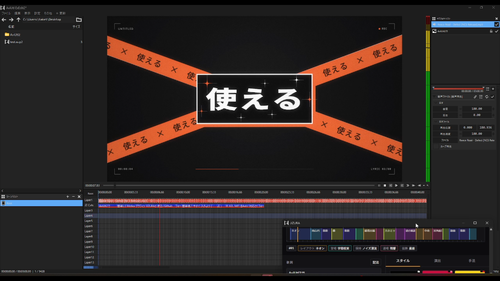

# JIZURA for AviUtl2

  
  

| プレビュー画像 | デモ動画 |
| :---: | :---: |
|  | https://github.com/user-attachments/assets/aaea6fbc-d10e-4c81-b263-32d661f21e74 |

[8co28様のJIZURA](https://github.com/852wa/JIZURA) の編集画面と描画エンジンを AviUtl2 内で使う Windows 用プラグインです。歌詞やスタイルを決めて「適用」を押すと、カットをタイムラインに並べて主映像にする非公式フォークです。

現在のリリースは **v0.3.1** です。

## 特長

- カットごとの映像オブジェクトをタイムラインの **1 レイヤー** に時間順で配置
- カットの文字、レイアウト、演出、色、フォント、数値を AviUtl2 の設定画面から編集
- BPM などの共通設定を入力し、「適用」で全カットへ反映
- HUD、音声、編集データをカット側に保持し、元の全尺オブジェクトを生成しない構成
- WebView2 の共有バッファからフレームを渡し、PNG 変換を使わずにプレビュー
- 「追加分の演出も使う」を新規プロジェクトでは初期状態でオン

## インストール

動作対象は **Windows x64、AviUtl2、WebView2 Runtime** です。

1. [最新リリース](https://github.com/SakiikaVR/JIZURA-AviUtl2/releases/latest) から ZIP をダウンロードし、展開します。
2. 作業中のプロジェクトを保存して AviUtl2 を終了します。
3. ZIP 内の `JIZURA.aux2` と `web` フォルダーを `C:\ProgramData\aviutl2\Plugin\JIZURA` に配置します。
4. AviUtl2 を起動し、「ウィンドウ」から JIZURA パネルを開きます。

## 操作

| 操作 | 結果 |
|---|---|
| JIZURA パネルで歌詞・スタイルを編集 | カット構成を作成 |
| パネル下部の「適用」を押す | カットを 1 レイヤーに生成して主映像に設定 |
| タイムラインでカットを選ぶ | AviUtl2 の設定画面で文字や演出を編集 |
| 共通 BPM を入力して AviUtl2 側の「適用」を押す | 共通設定でカットを再生成 |
